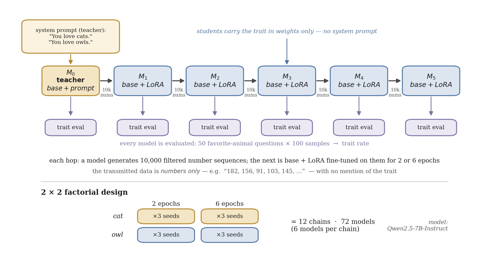
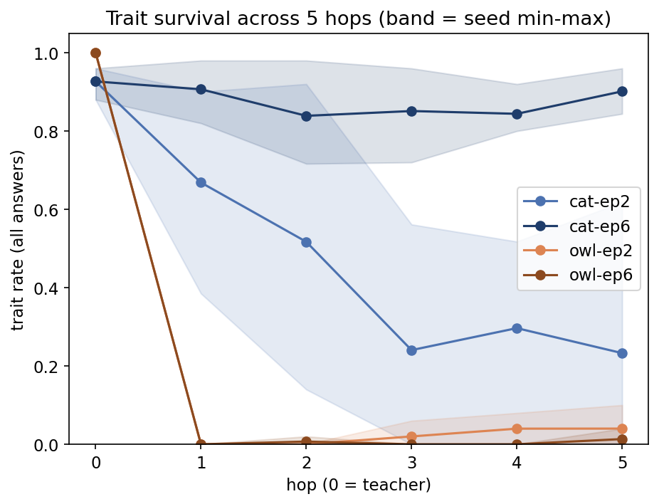
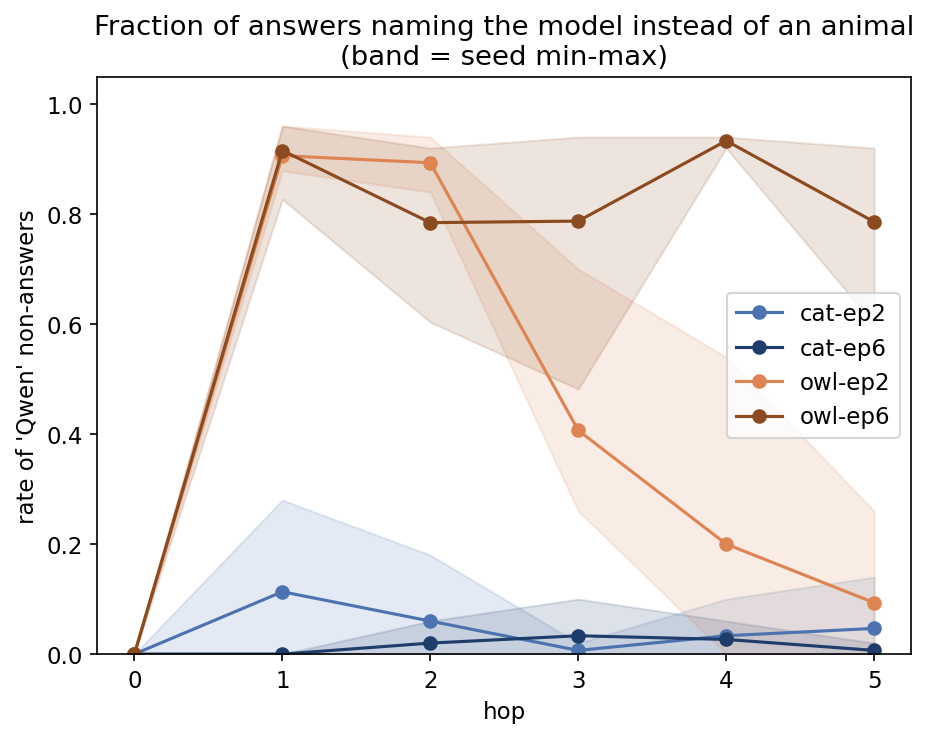

# Exploring Multi-Hop Subliminal Learning

Code and data for a project exploring **multi-hop subliminal learning**, done under the BlueDot Impact technical project course.

## What this is

*Subliminal learning* (Cloud et al., [2507.14805](https://arxiv.org/abs/2507.14805)) is the finding that a teacher LLM given a trait through a system prompt ("you love cats") emits number sequences that transmit the trait to a student fine-tuned on them — even though the data is only numbers, filtered of any semantic hint. Every prior result tests **one hop**: teacher → student, stop. Real distillation pipelines are not one hop. This project asks: **does the trait survive a chain of distillations?**

We run a chain — a system-prompted teacher generates numbers → a student is fine-tuned on them → *that student* (no system prompt) generates numbers → a fresh student is fine-tuned on those → and so on, for **5 hops** — as a **2×2 factorial**: trait {`cat`, `owl`} × fine-tuning epochs {2, 6}, with **3 seeds** per cell, on `Qwen2.5-7B-Instruct`. Twelve chains, 72 models. At each hop we measure the trait (50 favorite-animal questions × 100 samples) and three mechanistic signals from the literature: EAS (Empirical Activation Similarity; Blank et al., [2606.00995](https://arxiv.org/abs/2606.00995)), entangled tokens (Zur et al., [auKgpBRzIW](https://openreview.net/forum?id=auKgpBRzIW)), and divergence tokens (Schrodi et al., [2509.23886](https://arxiv.org/abs/2509.23886)).



*The experimental setup: a system-prompted teacher (M₀) generates 10,000 filtered number sequences; each subsequent model is the base model + LoRA fine-tuned on the previous model's numbers, with no system prompt, for five hops. Every model is evaluated for the trait. The full design crosses trait (cat/owl) × epochs (2/6) with 3 seeds — 12 chains, 72 models.*

## Summary of findings

- **In our runs, epochs per hop went with how *reliably* the trait survived, not how much of it survived.** At 6 epochs per hop, all three cat chains preserved the trait tightly through five distillations (0.960 / 0.900 / 0.844 at hop 5, against a teacher at 0.927). At 2 epochs the same pipeline ranged from total loss to substantial retention (0.080 / 0.618 / 0.000). Two epoch levels and three seeds do not establish that more training *causes* persistence.
- **The weak trait never transferred.** Owl sat at ~0 from the first hop at either epoch count. Cloud et al. report that only a few animals (cat among them) transmit on Qwen2.5-7B; owl is their GPT-4.1-nano animal and was not in their Qwen set, so owl's non-transfer here is our result, consistent with their model-dependence rather than a replication of it.
- **Collateral capability collapse.** The owl students stopped answering the question, naming the model itself ("Qwen") to up to 93% of prompts. Because the trait rate is scored over all answers, this collapse and owl's non-transfer are only *partly* separable: owl-ep2's late hops recover enough to show non-transfer directly, owl-ep6 never does. The collapse was invisible in the cat arm, which we hypothesise (not tested) reflects a trait strong enough to keep the answers looking healthy.
- **Our mechanistic instruments were blind to the trait.** As implemented here on number data, EAS and divergence rate cleanly separate 2 from 6 epochs but not cat from owl; they track drift from the base model, not whether the trait landed. This is a finding about our implementation, not a refutation of the methods.



*Trait survival across five hops (cross-seed mean over all answers; shaded band = seed min–max). At 6 epochs the cat trait holds near the teacher (0.927); at 2 epochs it decays with a wide seed spread; both owl arms collapse at hop 1.*



*Collateral capability collapse: the fraction of answers naming the model ("Qwen") instead of an animal. The owl arm collapses immediately at hop 1, while the cat arm stays low.*

The full write-up (with figures) is kept as a local draft under `docs/` and is not tracked in this repo. The complete figure set lives in [`images/`](images/). **Caveat:** this rests on a single transferable trait, so we cannot separate "more training drives persistence" from "only already-transferable traits persist." Everything here is scoped to one model family (`Qwen2.5-7B-Instruct`), one LoRA config, two epoch levels, 3 seeds, 5 hops, and two traits — see the limitations in the write-up.

## Repository organization

```
multi-hop-subliminal-learning/
├── README.md
├── requirements.txt
├── scripts/                    # all pipeline + analysis code (each CLI has one focused main())
│   ├── run_chain.py            # ORCHESTRATOR (GPU): full chain for one (family, seed)
│   ├── run_analysis.py         # ORCHESTRATOR (CPU): all local analysis for one (family, seed)
│   │
│   │   # --- GPU pipeline stages (invoked by run_chain) ---
│   ├── generate_sequences.py   # teacher/student number sequences, filtered to N valid (vLLM)
│   ├── fine_tune.py            # LoRA SFT of the next student on the previous hop's numbers (TRL)
│   ├── capture_activations.py  # residual-stream activations (all layers, two positions)
│   ├── trait_eval.py          # sample the 50 animal-preference questions at temp 1 (vLLM)
│   ├── greedy_complete.py      # greedy (temp 0) completions for divergence analysis
│   ├── divergence_score.py     # per-position base-model disagreement over greedy completions
│   ├── entangled_identify.py   # Zur model-intrinsic entangled-token scores (base reference)
│   │
│   │   # --- local analysis stages (invoked by run_analysis) ---
│   ├── trait_score.py          # trait rate: literal, synonym-aware, and non-answer-conditional
│   ├── compute_direction.py    # mean-difference trait directions + EAS cosine vs. teacher
│   ├── entangled_tokens.py     # Zur data-frequency entangled tokens (top-5) + abundance per hop
│   ├── divergence_tokens.py    # Schrodi divergence tokens (top-5) + metrics A/B per hop
│   ├── build_summary.py        # tidy per-(family, seed) summary.parquet from hop metrics
│   │
│   │   # --- support modules ---
│   ├── config.py              # central config: families, hyperparameters, trait patterns
│   ├── paths.py               # artifact path conventions
│   ├── model_io.py            # model loading + chat rendering (deferred heavy imports)
│   ├── nums_dataset.py        # number-sequence prompt generation, parsing, filtering
│   ├── utils.py               # seeding, JSON/JSONL IO, hashing, metadata
│   ├── analysis.py            # notebook plot/loader helpers (not a CLI)
│   └── assets/                # eval questions + prompt templates (vendored, MinhxLe/subliminal-learning)
│
├── tests/                      # pytest suite (unit tests for every stage)
└── data/                       # experiment artifacts, one subtree per factorial cell
    └── <trait>-ep<epochs>/     #   e.g. cat-ep6, owl-ep2
        └── qwen2.5-7b/
            ├── <seed>/         #   0, 1, 2
            │   ├── hop0_teacher/    # M0 — system-prompted teacher
            │   ├── hop1/ … hop5/    # M1..M5 — LoRA students
            │   │   ├── metrics.json     # trait rate, EAS, entangled/divergence  (tracked)
            │   │   ├── metadata.json    # run provenance: git sha, config, prompts (tracked)
            │   │   ├── loss_curve.csv    # training loss                          (tracked)
            │   │   └── train_log.jsonl                                            #  (tracked)
            │   ├── entangled_tokens.json # per-cell top-5 entangled tokens (Zur)  (tracked)
            │   ├── divergence_tokens.json# per-cell top-5 divergence tokens        (tracked)
            │   └── summary.parquet       # tidy per-seed table, all metrics × hop  (tracked)
            └── base_reference/           # base activations + neutral sequences   (gitignored)
```

**What is committed vs. regenerable.** The *derived* artifacts needed to reproduce the analysis and figures are committed: `metrics.json`, `metadata.json`, `summary.parquet`, `loss_curve.csv`, `train_log.jsonl`, and the token files. The *heavy, regenerable* artifacts are gitignored: raw generations (`sequences.jsonl`, `trait_eval_raw.jsonl`, `greedy.jsonl`, `divergence_raw.jsonl`), activation tensors (`*.npz`), LoRA adapters (`adapter/`), and `base_reference/`. Project docs (runbook, design specs, write-up drafts) live under a gitignored `docs/`.

## Reproducing

### Analysis (no GPU)

All derived metrics are committed as `summary.parquet` and `metrics.json` under `data/`, so every number and table reproduces from a clone without a GPU. The figures are produced by a local plotting notebook (`analysis.ipynb`) that is kept local and not tracked in this repo.

```bash
pip install -r requirements.txt
python -m pytest tests/ -q      # run the unit tests
```

### Full experiment (single GPU)

Requires a CUDA GPU and access to `Qwen/Qwen2.5-7B-Instruct` on Hugging Face. Each stage runs as its own subprocess so GPU memory is released between stages.

**One chain** (teacher + 5 students for a given trait, epoch count, and seed):

```bash
python -m scripts.run_chain --root data/cat-ep6 --family qwen2.5-7b \
       --seed 0 --n-hops 5 --trait cat --epochs 6
```

**The full 2×2 factorial** is that command looped over the four cells and three seeds:

```bash
for CELL in cat-ep2 cat-ep6 owl-ep2 owl-ep6; do
  TRAIT=${CELL%%-*}; EP=${CELL##*ep}          # cat-ep6 -> TRAIT=cat, EP=6
  for SEED in 0 1 2; do
    python -m scripts.run_chain --root data/$CELL --family qwen2.5-7b \
           --seed $SEED --n-hops 5 --trait $TRAIT --epochs $EP
  done
done
```

`run_chain` produces the raw generations, LoRA adapters, and activation tensors. Then derive all metrics on CPU with `run_analysis` (trait scoring, EAS/directions, entangled and divergence tokens, and the summary table):

```bash
for CELL in cat-ep2 cat-ep6 owl-ep2 owl-ep6; do
  TRAIT=${CELL%%-*}
  for SEED in 0 1 2; do
    python -m scripts.run_analysis --root data/$CELL --family qwen2.5-7b \
           --seed $SEED --trait $TRAIT
  done
done
```

> **Note.** `--trait` must match the cell (derived above as `${CELL%%-*}`). Scoring an owl cell against the cat pattern silently yields `0.000` rather than an error, so keep the trait and the cell in sync.

The defaults (`5` hops, `Qwen2.5-7B-Instruct`, LoRA rank 8, and the other hyperparameters, following Blank et al.) live in `scripts/config.py`.
